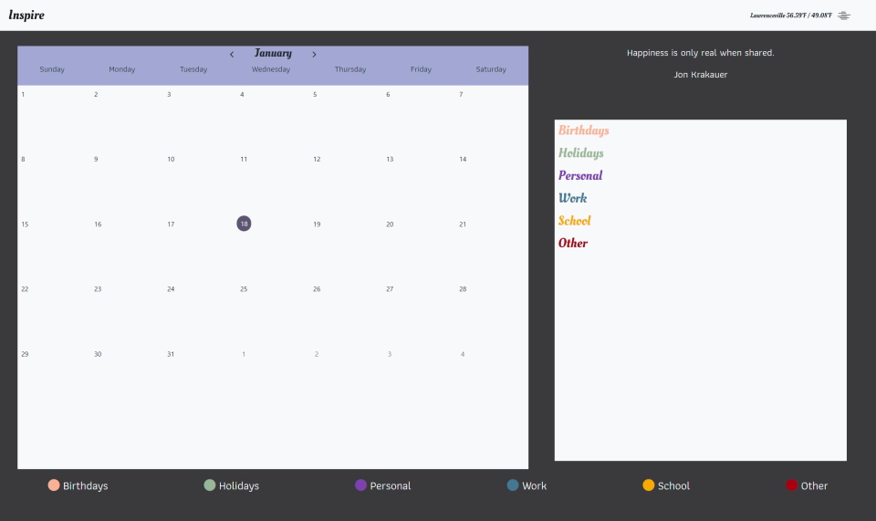

# Project-One - Inspire Calendar
Inspire Calendar is an interactive calendar where you can save important dates and events of every month. At the top of you will be presentated with and inpirational quote so you have a slight boost of motivation as you begin your day. 

## Usage
To use this calendar you need to simply double click on whichever date you desire to open. After that a box will pop up and give you options of what type of event is important for this date and then you press create and your specific event will appear in the side bar next to the calendar itself.

## Project-1 
At the conclusion of each phase of this course you will work with a group of your fellow students to create a project. A project is a collabrative work among a group of developers to create an application that solves a real-world probrlem. Projects model the experiance you will encounter in every development role at any company, from large multinational businesses to small start ups.

## Project Requirements
You and your group will use everything you’ve learned over the past six modules to create a real-world front-end application that you’ll be able to showcase to potential employers. The user story and acceptance criteria will depend on the project that you create, but your project must fulfil the following requirements:

* Use a CSS framework other than Bootstrap.

* Be deployed to GitHub Pages.

* Be interactive (i.e., accept and respond to user input).

* Use at least two [server-side APIs](https://coding-boot-camp.github.io/full-stack/apis/api-resources).

* Does not use alerts, confirms, or prompts (use modals).

* Use client-side storage to store persistent data.

* Be responsive.

* Have a polished UI.

* Have a clean repository that meets quality coding standards (file structure, naming conventions, follows best practices for class/id naming conventions, indentation, quality comments, etc.).

* Have a quality README (with unique name, description, technologies used, screenshot, and link to deployed application).

## Project Links
[Github Repo](https://github.com/MasakiSenpai/Project-One)\
[Live URL](https://masakisenpai.github.io/Project-One/)

## Visuals
